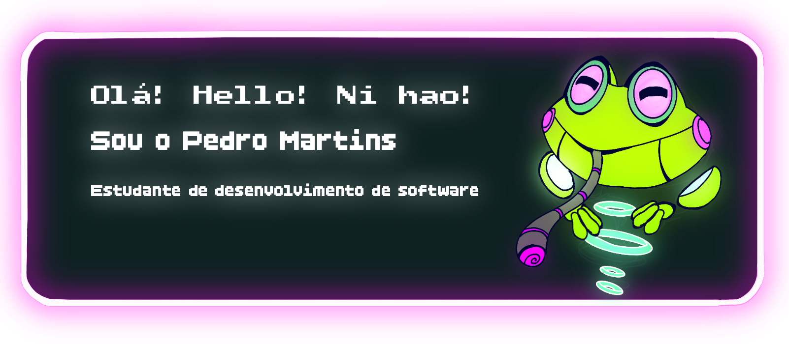

<h1 align="center">👋 Tudo bem? Sou o Pedro 👽</h1>

### 💻 Estudante de programação e 🖼️ design

---

🧩 Estou cursando Desenvolvimento de Software Multiplataforma (4º semestre)  

🌱 Tenho como objetivo registrar minha evolução na área de TI

  

   

   

  
  

# 🤖 Minhas ferramentas e linguagens
<table>

  
  
  
  
  
  
  
  
  
  
  
  
  
  
  
  
  
  
  
  
  
  
  
  
  
  
  
  
  

</table>

###

###
